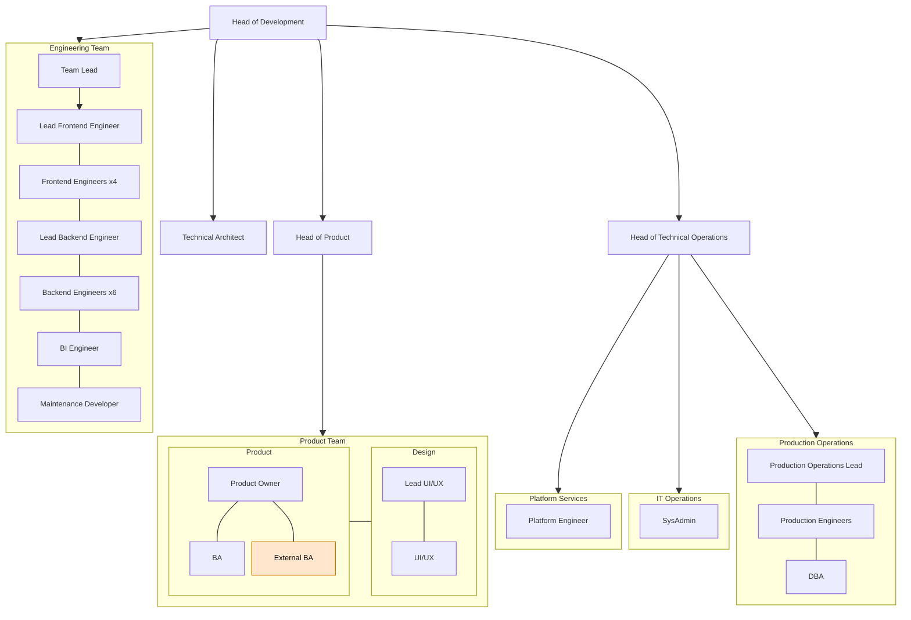

# Organisation Chart

> **Info:** There are 28 roles and 1 external role. Totalling a team of 29.

## Roles

- **Head of Development**: `Roles/HeadOfDevelopment.md`
- **Head of Product**: `Roles/Product/HeadOfProduct.md`
- **Technical Architect**: `Roles/TechnicalArchitect.md`
- **Team Lead**: `Roles/Development/TeamLead.md`
- **BI Engineer**: `Roles/Development/BIEngineer.md`
- **BA (Business Analyst)**: `Roles/Product/BA.md`
- **Product Owner**: `Roles/Product/ProductOwner.md`
- **UI/UX**: `Roles/Product/UIUX.md`
- **Lead UI/UX**: `Roles/Product/LeadUIUX.md`
- **Lead Frontend Engineer**: `Roles/Development/LeadFrontendEngineer.md`
- **Frontend Engineer**: `Roles/Development/FrontendEngineer.md`
- **Lead Backend Engineer**: `Roles/Development/LeadBackendEngineer.md`
- **Backend Engineer**: `Roles/Development/BackendEngineer.md`
- **Maintenance Developer**: `Roles/Development/MaintenanceDeveloper.md`
- **Head of Technical Operations**: `Roles/TechnicalOperations/HeadOfTechnicalOperations.md`
- **SysAdmin**: `Roles/TechnicalOperations/SysAdmin.md`
- **Production Operations Lead**: `Roles/TechnicalOperations/ProductionOperationsLead.md`
- **DBA**: `Roles/TechnicalOperations/DBA.md`
- **Production Engineer**: `Roles/TechnicalOperations/ProductionEngineer.md`
- **Platform Engineer**: `Roles/TechnicalOperations/PlatformEngineer.md`
