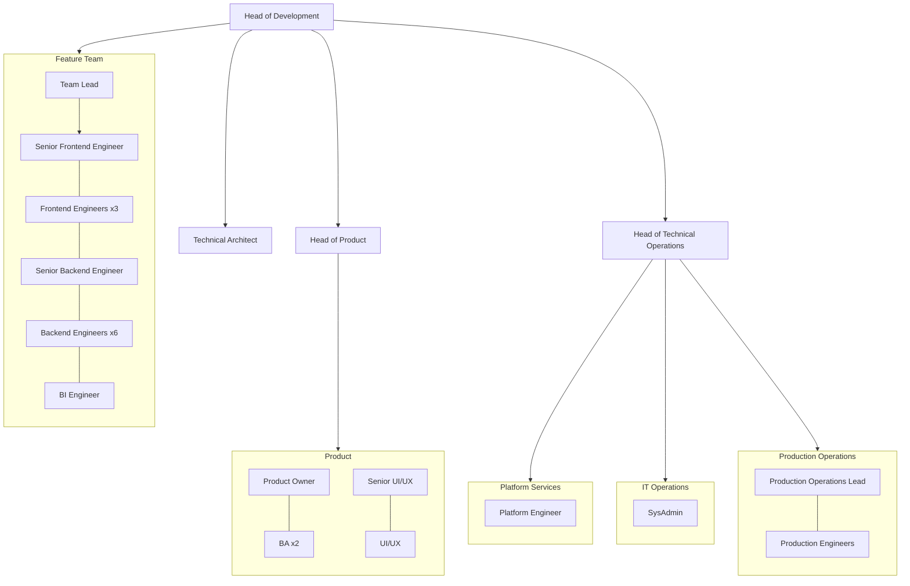

# Organisation Chart

## Roles

- **Head of Development**: `Roles/HeadOfDevelopment.md`
- **Head of Product**: `Roles/Product/HeadOfProduct.md`
- **Technical Architect**: `Roles/TechnicalArchitect.md`
- **Team Lead**: `Roles/Development/TeamLead.md`
- **BA (Business Analyst)**: `Roles/Product/BA.md`
- **Product Owner**: `Roles/Product/ProductOwner.md`
- **UI/UX**: `Roles/Product/UIUX.md`
- **Senior UI/UX**: `Roles/Product/SeniorUIUX.md`
- **Senior Frontend Engineer**: `Roles/Development/SeniorFrontendEngineer.md`
- **Frontend Engineer**: `Roles/Development/FrontendEngineer.md`
- **Senior Backend Engineer**: `Roles/Development/SeniorBackendEngineer.md`
- **Backend Engineer**: `Roles/Development/BackendEngineer.md`
- **QA (Quality Assurance)**: `Roles/Product/QA.md`
- **Senior QA**: `Roles/Product/HeadOfQA.md`
- **Head of Technical Operations**: `Roles/TechnicalOperations/HeadOfTechnicalOperations.md`
- **SysAdmin**: `Roles/TechnicalOperations/SysAdmin.md`
- **Production Operations Lead**: `Roles/TechnicalOperations/ProductionOperationsLead.md`
- **DBA**: `Roles/TechnicalOperations/DBA.md`
- **Production Engineer**: `Roles/TechnicalOperations/ProductionEngineer.md`
- **Platform Engineer**: `Roles/TechnicalOperations/PlatformEngineer.md`
