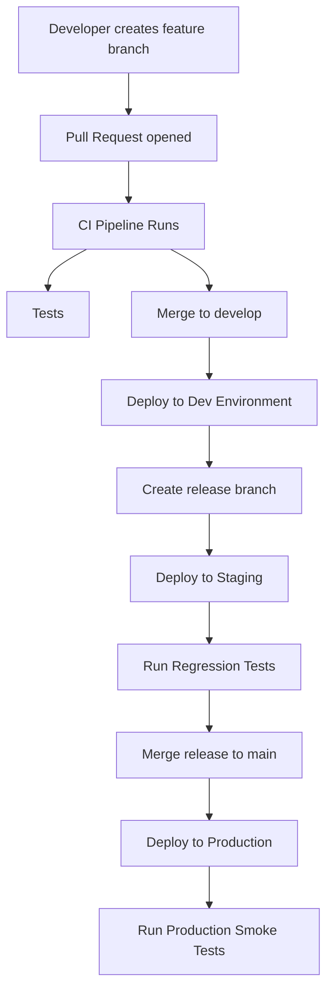
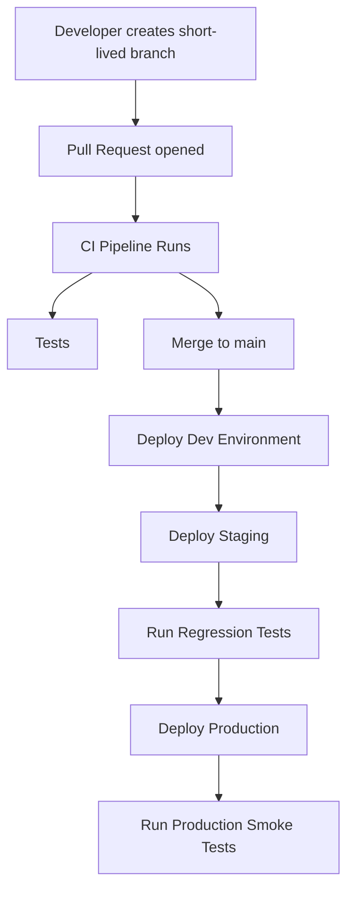

# CI/CD, Testing Strategy, and Future Migration to Trunk-Based Development

## Overview

This document describes our current **GitFlow-based development workflow**, how our **automated testing pipeline operates across environments**, and our **future plan to migrate to Trunk-Based Development once feature flags are fully implemented**.

Our goals are:

- Fully automated testing
- Reliable deployments
- Clear promotion of builds through environments
- A safe path toward modern continuous delivery practices

---

# Current Development Model: GitFlow

At present we follow a **GitFlow branching strategy**.

Branches are structured as follows:

- `feature/*` – individual feature work
- `develop` – integration branch
- `release/*` – release preparation
- `main` – production code
- `hotfix/*` – urgent production fixes

Code moves through branches before reaching production.

---

# Environment Promotion Model

Each branch corresponds to deployment environments and automated testing stages.

| Branch | Environment | Purpose |
|---|---|---|
| `feature/*` | Local | Developers run unit, integration, and contract tests locally to validate changes before a pull request. |
| `develop` | Dev | Continuous integration of features. Deployed to a shared environment for internal review and to ensure features work together. |
| `release/*` | Staging | A release candidate is deployed for final E2E regression testing and user acceptance testing (UAT). |
| `main` | Production | Represents the live, customer-facing application. Only stable, tested code is merged here. |

# CI/CD Pipeline Flow

Below is the high-level flow of the GitFlow pipeline.

---

# Future State: Trunk-Based Development

Once feature flags are fully implemented, we will migrate to a **Trunk-Based Development** model to simplify our branching strategy and accelerate delivery.

In this model, all developers commit directly to a single `main` branch. Long-lived branches are eliminated in favour of short-lived feature branches that are merged quickly.

## CI/CD Pipeline Flow (Trunk-Based)

Below is the high-level flow of the target Trunk-Based pipeline.

